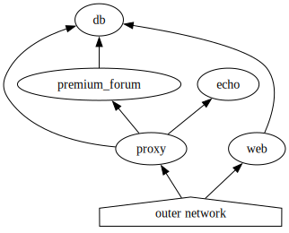

# OnlyFlags

## Service topology


## Generate keys for licensing

```sh
openssl genrsa -out jwt_priv.pem 2048
openssl rsa -in jwt_priv.pem -pubout -out jwt_pub.crt
mv jwt_priv.pem checker/
mv jwt_pub.pem service/web/
```

## Basic Usage

after creating an account the user can access the internal_net with
```sh
ncat --proxy $TARGET_IP --proxy-type socks5 --proxy-dns remote --proxy-auth $USER:$PW $SERVICE $SERVICE_PORT
```

To test the access the user can use the `echo` service with the port `1337`.


## Vulnearbilities

### 1st vuln in the proxy service

An error in population of the `Proxy.UserCache` in the proxy server makes it possible to access the restricted service for a short period of time after the user registers.


